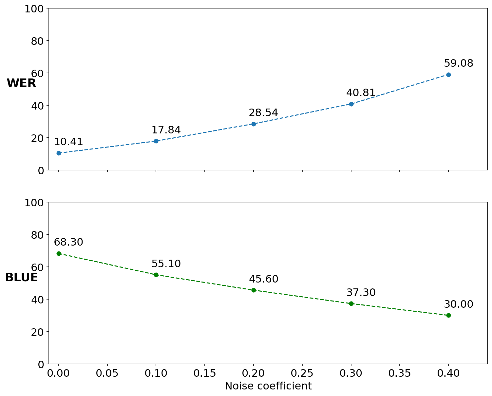

# E2E_ST

## Results

### ASR model: JasperDR-10×5 

Dataset| dev-clean | test-clean | dev-other 
--- | --- | --- | --- |
WER | 0.0346 | 0.0368 | 0.10405

____________________________________________________________
### MT model: Yandex translation

Dataset| dev-clean | test-clean | dev-other 
--- | --- | --- | --- |
BLEU score | 0.849 | 0.851 | 0.683

### MT model: transformer.wmt19.en-ru (fairseq)

Dataset| dev-clean |
--- | --- |
BLEU score | 0.824 | 
____________________________________________________________
### Adding Noise to dev-other dataset

